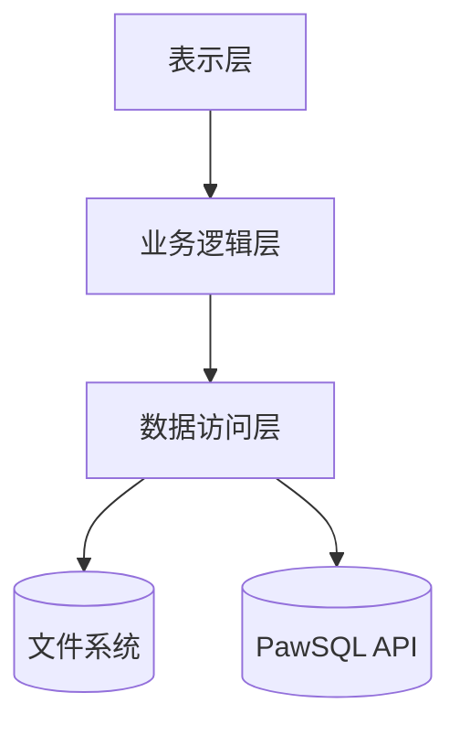
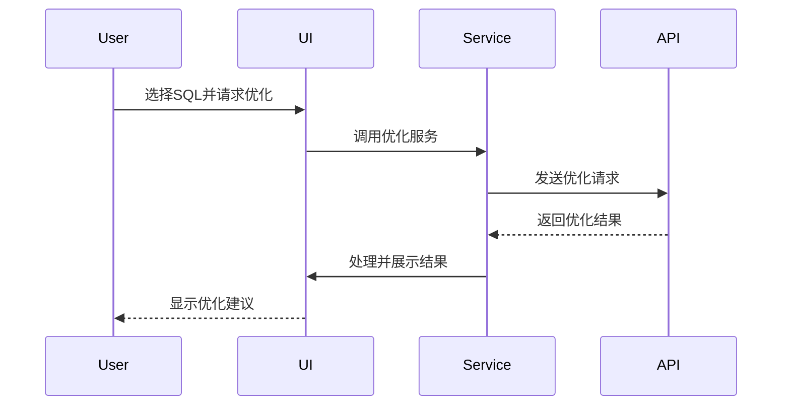
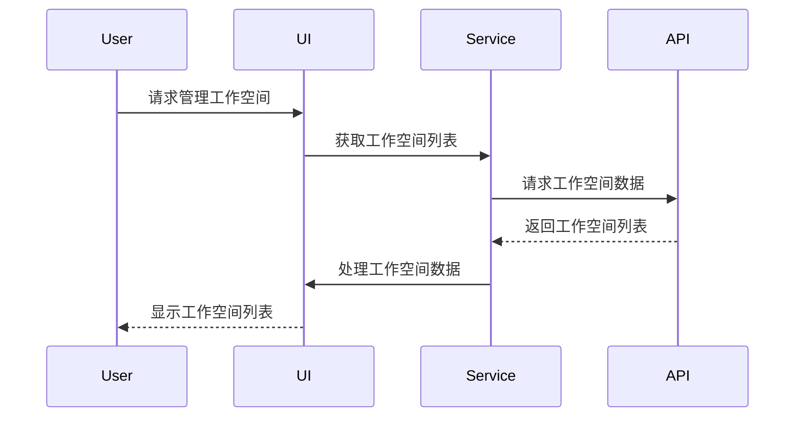

# PawSQL Advisor 架构设计

## 整体架构

PawSQL Advisor采用分层架构设计，主要包含以下几层：

### 1. 表示层 (UI)
- 提供用户界面组件
- 处理用户交互
- 展示优化结果

主要组件：
- `WorkspaceDialog`: 工作空间管理对话框
- `OptimizationResultDialog`: 优化结果展示对话框
- `ConfigDialog`: 配置管理对话框

### 2. 业务逻辑层 (Service)
- 实现核心业务逻辑
- 协调各个组件的工作
- 处理数据转换和验证

主要组件：
- `OptimizationService`: SQL优化服务
- `WorkspaceService`: 工作空间管理服务
- `OptimizeResultHandler`: 优化结果处理服务

### 3. 数据访问层 (DAO)
- 处理数据持久化
- 管理文件操作
- 处理HTTP请求

主要组件：
- `PawFileManager`: 文件管理器
- `PawHttpClient`: HTTP客户端
- `ConfigLoader`: 配置加载器

## 组件交互



## 关键流程

### 1. SQL优化流程



### 2. 工作空间管理流程



## 数据模型

### 1. 配置模型
```json
{
    "server": {
        "baseUrl": "string"
    },
    "auth": {
        "username": "string",
        "userKey": "string"
    },
    "optimization": {
        "autoOptimize": "boolean",
        "saveHistory": "boolean",
        "reportLanguage": "string",
        "maxSqlLength": "number"
    }
}
```

### 2. 工作空间模型
```json
{
    "id": "string",
    "name": "string",
    "description": "string",
    "createTime": "datetime",
    "updateTime": "datetime"
}
```

### 3. 优化结果模型
```json
{
    "id": "string",
    "sql": "string",
    "optimizedSql": "string",
    "suggestions": [
        {
            "type": "string",
            "description": "string",
            "impact": "number"
        }
    ],
    "executionPlan": "object",
    "timestamp": "datetime"
}
```

## 扩展点

1. 优化引擎
- 支持添加新的优化规则
- 支持自定义优化策略
- 支持新的数据库类型

2. 报告生成
- 支持自定义报告模板
- 支持多种输出格式
- 支持国际化

3. 存储层
- 支持多种存储后端
- 支持云存储
- 支持分布式存储

## 安全考虑

1. 认证和授权
- 使用API密钥进行认证
- 支持多用户隔离
- 支持权限控制

2. 数据安全
- 本地配置加密存储
- 敏感信息脱敏
- HTTPS传输

3. 审计日志
- 操作日志记录
- 错误日志记录
- 性能监控
