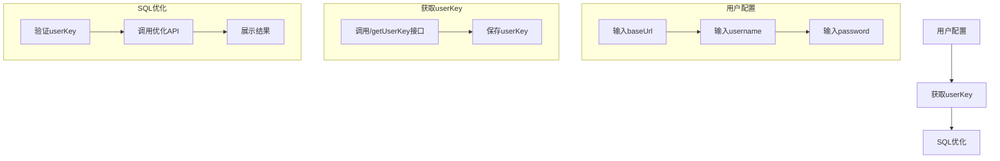
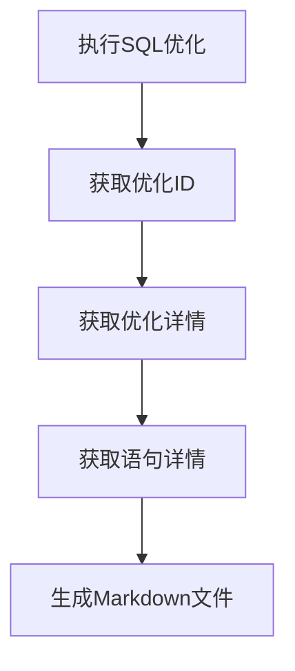
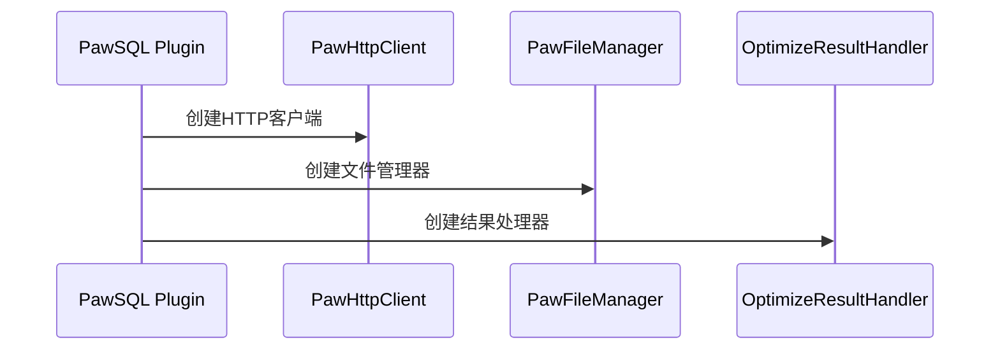
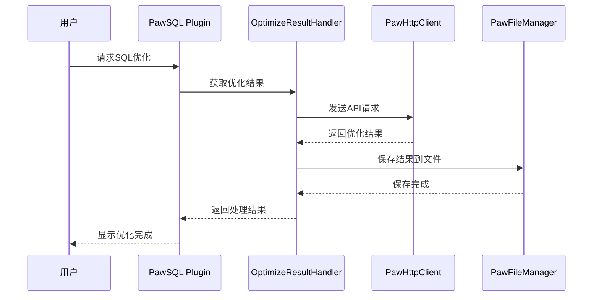
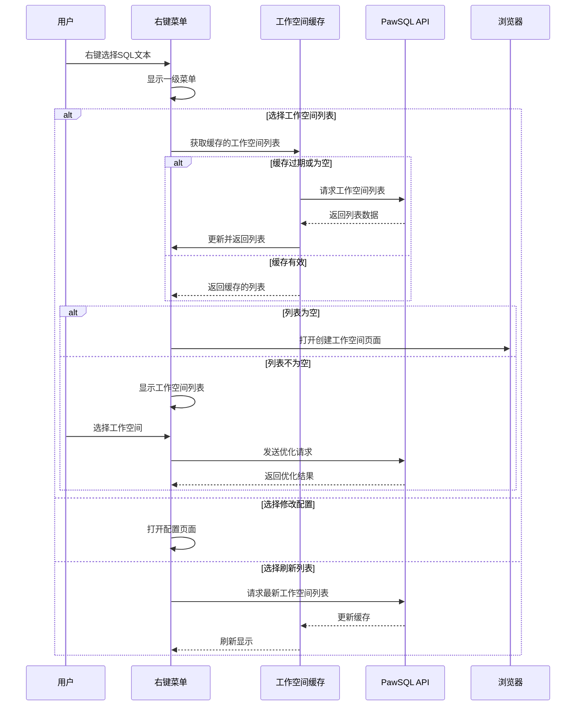

# PawSQL Advisor 重构计划

## 一、已确认的改造方案

### 1. 配置系统改造

#### 1.1 配置项简化

原有配置：

```java
- dbType          // 数据库类型
- dbHost          // 数据库主机
- dbPort          // 数据库端口
- user            // 数据库用户名
- passwd          // 数据库密码
- defaultDB       // 默认数据库
- schemaList      // schema列表
```

改造后配置：

```java
- baseUrl         // API服务地址
- username        // 用户名（email）
- password        // 密码
- userKey         // 通过登录获取的userKey
```

#### 1.2 配置流程

1. 用户输入基本配置（baseUrl, username, password）
2. 调用`/getUserKey`接口获取userKey
3. 保存userKey用于后续API调用

### 2. 新增组件

#### 2.1 HTTP客户端服务

```java
public class PawHttpClient {
    private String baseUrl;
    private String userKey;
    
    // 登录并获取userKey
    public String login(String username, String password);
    
    // 验证userKey
    public boolean validateUserKey(String userKey);
    
    // API调用方法
    public ApiResult callApi(String endpoint, Object requestBody);
}
```

#### 2.2 API模型类

```java
public class ApiResult {
    private boolean success;
    private String message;
    private Object data;
}
```

### 3. 需要修改的文件

#### 3.1 配置相关

- `PawSettingState.java`: 简化配置项
- `PawSettingPage.java`: 重新设计配置界面
- `PawSettingPage.form`: 更新UI表单

#### 3.2 功能相关

- `RunSelectedAction.java`: 改用API调用方式
- `RunAction.java`: 改用API调用方式

### 4. 新的工作流程



## 二、待确认的改造方向

1. API接口集成
    - [ ] 确定需要集成的所有API接口
    - [ ] 设计API调用错误处理机制
    - [ ] 设计API响应缓存策略

2. 用户界面
    - [ ] 优化配置页面布局
    - [ ] 改进结果展示方式
    - [ ] 添加更多用户反馈

3. 性能优化
    - [ ] API调用性能
    - [ ] 响应数据缓存
    - [ ] UI响应速度

4. 安全性
    - [ ] 密码加密存储
    - [ ] API通信安全
    - [ ] 敏感信息处理

## 三、后续计划

等待进一步的改造需求...

## 四、注意事项

1. 保持向后兼容性
2. 确保数据安全性
3. 优化用户体验
4. 完善错误处理
5. 添加必要的日志记录

## 五、时间线

待定...

## 六、功能精简

### 6.1 移除文件优化功能

- 移除整个文件优化功能
- 删除相关代码：
  ```java
  - RunAction.java             // 删除整个文件
  - RunConfigAction.java       // 删除整个文件
  ```

### 6.2 保留的功能

- 仅保留选中SQL优化功能
  ```java
  - RunSelectedAction.java     // 保留并优化
  - RunSelectedConfigAction.java // 保留并优化
  ```

### 6.3 菜单改造

原有菜单：

```xml
<group id="PawSQL" text="PawSQL Advisor" popup="true">
    <action id="RunSelectedAction" />
    <action id="RunSelectedConfigAction" />
    <action id="RunAction" />          <!-- 移除 -->
    <action id="RunConfigAction" />    <!-- 移除 -->
</group>
```

改造后菜单：

```xml
<group id="PawSQL" text="PawSQL Advisor" popup="true">
    <action id="RunSelectedAction" text="Optimize Selected SQL"/>
    <action id="RunSelectedConfigAction" text="Optimize Selected SQL Config..."/>
</group>
```

## 七、代码清理

### 7.1 需要删除的文件

- `RunAction.java`
- `RunConfigAction.java`

### 7.2 需要修改的文件

- `plugin.xml`: 移除文件优化相关的action配置
- `PawWindowFactory.java`: 简化工具窗口，仅保留选中SQL优化相关功能

## 八、优化结果处理

#### 8.1 API调用流程



#### 8.2 文件保存逻辑

1. **目录结构**
   ```
   [当前SQL文件目录]/
   └── pawsql/
       └── [优化名称].md
   ```

2. **Markdown内容**
    - 从`StatementDetailInfoRead`获取：
      ```java
      - detailMarkdown      // 英文版优化报告
      - detailMarkdownZh    // 中文版优化报告
      ```

3. **实现步骤**
   ```java
   1. 获取当前文件路径
   2. 创建pawsql目录
   3. 根据优化名称创建md文件
   4. 写入优化报告内容
   ```

#### 8.3 需要新增的组件

1. **文件管理类**

```java
public class PawFileManager {
    // 创建pawsql目录
    public void createPawsqlDir(String currentFilePath);
    
    // 保存优化报告
    public void saveOptimizeReport(String currentFilePath, 
                                 String optimizeName,
                                 String markdownContent);
}
```

2. **优化结果处理类**

```java
public class OptimizeResultHandler {
    // 处理优化结果
    public void handleOptimizeResult(String optimizeId);
    
    // 获取优化详情
    public OptimizeDetail getOptimizeDetail(String optimizeId);
    
    // 获取语句详情
    public StatementDetail getStatementDetail(String statementId);
}
```

#### 8.4 相关API

1. 获取优化详情
   ```
   POST /getStatementList
   请求体: IdRequestBody
   ```

2. 获取语句详情
   ```
   POST /getStatementDetail
   请求体: IdRequestBody
   ```

#### 8.5 错误处理

1. 目录创建失败
2. 文件写入失败
3. API调用失败
4. 优化结果解析失败

## 九、数据结构

#### 1. 优化结果数据结构 (StatementDetailInfoRead)

```java
public class StatementDetailInfoRead {
    private String analysisId;           // 分析ID
    private String analysisName;         // 分析名称
    private String stmtId;               // 语句ID
    private String statementName;        // 语句名称
    private String stmtText;             // SQL文本
    private String detailMarkdown;       // 详细信息markdown文本(英文)
    private String detailMarkdownZh;     // 详细信息markdown文本(中文)
    private String openaiOptimizeTextEn; // openai优化结果文本(英文)
    private String openaiOptimizeTextZh; // openai优化结果文本(中文)
    private List<String> indexRecommended;           // 推荐的索引列表
    private List<RuleRewrittenQuery> rewrittenQuery; // 重写后的query
    private List<RuleRewrittenFragments> violationRule; // 违反的规则
    private ValidationDetails validationDetails;     // validate后的相关信息
}
```

#### 2. 优化总结数据结构 (SummaryStatementInfo)

```java
public class SummaryStatementInfo {
    private Long analysisStmtId;      // 分析语句ID
    private String stmtId;            // 语句ID
    private String stmtName;          // 语句名称
    private String stmtType;          // 语句类型
    private String stmtText;          // SQL文本
    private Double costBefore;        // 优化前代价
    private Double costAfter;         // 优化后代价
    private Integer numberOfRewrite;   // 重写出来的query数量
    private Integer numberOfRewriteRules; // 违反的重写规则数
    private Integer numberOfViolations;   // 违反的规则数量
    private Integer numberOfSyntaxError;  // 语法错误数目
    private Integer numberOfIndex;        // 推荐出来的索引数量
    private Integer numberOfHitIndex;     // 有效的索引数量
    private Double performance;           // 性能提升比例
    private String contributingIndices;   // 产生贡献的索引名
}
```

#### 3. Markdown文件内容结构

优化结果的Markdown文件将包含以下部分：

1. 标题部分
   ```markdown
   # Tuning Details for [queryId]
   *Powered by PawSQL(2022 - )*
   ```

2. 原始SQL
   ```markdown
   ## Original Query(formatted)
   ```sql
   [原始SQL语句]
   ```
   ```

3. 重写SQL(如果有)
   ```markdown
   ## Rewritten Query
   ```sql
   [重写后的SQL语句]
   ```

   ℹ️ __Applied rules__:
    - **[规则名称](./customLink/ruleInfo/[规则代码])**
   ```

4. 索引推荐
   ```markdown
   ## Index Analysis
   [索引分析内容]
   ```

5. 审计信息
   ```markdown
   ## Audit Details
   [审计详情]
   ```

6. 验证结论
   ```markdown
   ## Validation Results
   [验证结果]
   ```

## 十、API设计

### 1. 获取用户Key

```http
GET /api/user/key
```

**请求参数**

```json
{
  "username": "用户名",
  "password": "密码"
}
```

**响应结果**

```json
{
  "code": 200,
  "data": {
    "userKey": "用户密钥"
  }
}
```

### 2. 获取SQL优化结果

```http
GET /api/statement/detail/{stmtId}
```

**请求参数**

- stmtId: SQL语句ID

**响应结果**

```json
{
  "code": 200,
  "data": {
    "analysisId": "分析ID",
    "analysisName": "分析名称",
    "stmtId": "语句ID",
    "statementName": "语句名称",
    "stmtText": "SQL文本",
    "detailMarkdown": "详细信息markdown文本(英文)",
    "detailMarkdownZh": "详细信息markdown文本(中文)",
    "openaiOptimizeTextEn": "openai优化结果文本(英文)",
    "openaiOptimizeTextZh": "openai优化结果文本(中文)",
    "indexRecommended": ["推荐索引1", "推荐索引2"],
    "rewrittenQuery": [
      {
        "ruleCode": "规则代码",
        "rewrittenSql": "重写后的SQL"
      }
    ],
    "violationRule": [
      {
        "ruleCode": "规则代码",
        "fragments": ["违反规则的SQL片段"]
      }
    ],
    "validationDetails": {
      "costBefore": 100.0,
      "costAfter": 50.0,
      "performance": 50.0
    }
  }
}
```

### 3. 获取优化列表

```http
GET /api/statement/list/{analysisId}
```

**请求参数**

- analysisId: 分析ID

**响应结果**

```json
{
  "code": 200,
  "data": [{
    "analysisStmtId": "分析语句ID",
    "stmtId": "语句ID",
    "stmtName": "语句名称",
    "stmtType": "语句类型",
    "stmtText": "SQL文本",
    "costBefore": 100.0,
    "costAfter": 50.0,
    "numberOfRewrite": 1,
    "numberOfRewriteRules": 1,
    "numberOfViolations": 1,
    "numberOfSyntaxError": 0,
    "numberOfIndex": 2,
    "numberOfHitIndex": 1,
    "performance": 50.0,
    "contributingIndices": "idx_1,idx_2"
  }]
}
```

### 4. 错误码定义

| 错误码 | 说明      |
|-----|---------|
| 200 | 成功      |
| 400 | 请求参数错误  |
| 401 | 未授权     |
| 403 | 禁止访问    |
| 404 | 资源不存在   |
| 500 | 服务器内部错误 |

### 5. API安全

1. 认证方式
    - 使用Bearer Token认证
    - Token通过用户登录接口获取
    - Token有效期为24小时

2. 请求头要求

```http
Authorization: Bearer <token>
Content-Type: application/json
Accept-Language: en-US,zh-CN
```

3. 访问控制
    - 基于RBAC的权限控制
    - 支持IP白名单
    - 支持请求频率限制

## 十一、组件设计

### 1. PawHttpClient

负责处理所有HTTP请求的客户端组件。

```java
public class PawHttpClient {
    private String baseUrl;
    private String userKey;
    private OkHttpClient client;
    
    // 初始化客户端配置
    public PawHttpClient(String baseUrl, String userKey) {
        this.baseUrl = baseUrl;
        this.userKey = userKey;
        this.client = new OkHttpClient.Builder()
            .connectTimeout(30, TimeUnit.SECONDS)
            .readTimeout(30, TimeUnit.SECONDS)
            .writeTimeout(30, TimeUnit.SECONDS)
            .build();
    }
    
    // 发送GET请求
    public <T> T get(String path, Class<T> responseType) throws IOException {
        Request request = new Request.Builder()
            .url(baseUrl + path)
            .addHeader("Authorization", "Bearer " + userKey)
            .build();
            
        Response response = client.newCall(request).execute();
        return parseResponse(response, responseType);
    }
    
    // 发送POST请求
    public <T> T post(String path, Object body, Class<T> responseType) throws IOException {
        String json = new ObjectMapper().writeValueAsString(body);
        RequestBody requestBody = RequestBody.create(json, MediaType.parse("application/json"));
        
        Request request = new Request.Builder()
            .url(baseUrl + path)
            .post(requestBody)
            .addHeader("Authorization", "Bearer " + userKey)
            .build();
            
        Response response = client.newCall(request).execute();
        return parseResponse(response, responseType);
    }
    
    // 解析响应结果
    private <T> T parseResponse(Response response, Class<T> responseType) throws IOException {
        if (!response.isSuccessful()) {
            throw new IOException("Unexpected code " + response);
        }
        
        String responseBody = response.body().string();
        return new ObjectMapper().readValue(responseBody, responseType);
    }
}
```

### 2. PawFileManager

负责管理优化结果文件的组件。

```java
public class PawFileManager {
    private static final String PAWSQL_DIR = "pawsql";
    
    // 创建pawsql目录
    public void createPawsqlDir(String sqlFilePath) throws IOException {
        Path sqlPath = Paths.get(sqlFilePath);
        Path pawsqlPath = sqlPath.getParent().resolve(PAWSQL_DIR);
        Files.createDirectories(pawsqlPath);
    }
    
    // 生成优化结果文件名
    public String generateResultFileName(String analysisName, String stmtId) {
        return String.format("%s_%s_optimization.md", analysisName, stmtId);
    }
    
    // 保存优化结果
    public void saveOptimizationResult(String sqlFilePath, String analysisName, 
                                     String stmtId, String content) throws IOException {
        Path sqlPath = Paths.get(sqlFilePath);
        Path pawsqlPath = sqlPath.getParent().resolve(PAWSQL_DIR);
        String fileName = generateResultFileName(analysisName, stmtId);
        Path resultPath = pawsqlPath.resolve(fileName);
        
        Files.write(resultPath, content.getBytes(StandardCharsets.UTF_8));
    }
    
    // 读取优化结果
    public String readOptimizationResult(String sqlFilePath, String analysisName, 
                                       String stmtId) throws IOException {
        Path sqlPath = Paths.get(sqlFilePath);
        Path pawsqlPath = sqlPath.getParent().resolve(PAWSQL_DIR);
        String fileName = generateResultFileName(analysisName, stmtId);
        Path resultPath = pawsqlPath.resolve(fileName);
        
        return new String(Files.readAllBytes(resultPath), StandardCharsets.UTF_8);
    }
}
```

### 3. OptimizeResultHandler

负责处理优化结果的组件。

```java
public class OptimizeResultHandler {
    private PawHttpClient httpClient;
    private PawFileManager fileManager;
    
    public OptimizeResultHandler(PawHttpClient httpClient, PawFileManager fileManager) {
        this.httpClient = httpClient;
        this.fileManager = fileManager;
    }
    
    // 获取优化结果
    public StatementDetailInfoRead getOptimizationResult(String stmtId) throws IOException {
        return httpClient.get("/api/statement/detail/" + stmtId, StatementDetailInfoRead.class);
    }
    
    // 获取优化列表
    public List<SummaryStatementInfo> getOptimizationList(String analysisId) throws IOException {
        return httpClient.get("/api/statement/list/" + analysisId, 
            new TypeReference<List<SummaryStatementInfo>>() {}.getType());
    }
    
    // 保存优化结果到文件
    public void saveOptimizationResult(String sqlFilePath, StatementDetailInfoRead result) 
            throws IOException {
        fileManager.createPawsqlDir(sqlFilePath);
        String content = generateMarkdownContent(result);
        fileManager.saveOptimizationResult(sqlFilePath, result.getAnalysisName(), 
            result.getStmtId(), content);
    }
    
    // 生成Markdown内容
    private String generateMarkdownContent(StatementDetailInfoRead result) {
        StringBuilder markdown = new StringBuilder();
        
        // 添加标题
        markdown.append("# Tuning Details for ").append(result.getStmtId()).append("\n");
        markdown.append("*Powered by PawSQL(2022 - )*\n\n");
        
        // 添加原始SQL
        markdown.append("## Original Query(formatted)\n");
        markdown.append("```sql\n").append(result.getStmtText()).append("\n```\n\n");
        
        // 添加重写SQL
        if (result.getRewrittenQuery() != null && !result.getRewrittenQuery().isEmpty()) {
            markdown.append("## Rewritten Query\n");
            for (RuleRewrittenQuery query : result.getRewrittenQuery()) {
                markdown.append("```sql\n").append(query.getRewrittenSql()).append("\n```\n");
                markdown.append("Applied rule: ").append(query.getRuleCode()).append("\n\n");
            }
        }
        
        // 添加索引推荐
        if (result.getIndexRecommended() != null && !result.getIndexRecommended().isEmpty()) {
            markdown.append("## Index Analysis\n");
            for (String index : result.getIndexRecommended()) {
                markdown.append("- ").append(index).append("\n");
            }
            markdown.append("\n");
        }
        
        // 添加审计信息
        if (result.getValidationDetails() != null) {
            markdown.append("## Audit Details\n");
            markdown.append("- Cost Before: ").append(result.getValidationDetails().getCostBefore()).append("\n");
            markdown.append("- Cost After: ").append(result.getValidationDetails().getCostAfter()).append("\n");
            markdown.append("- Performance Improvement: ").append(result.getValidationDetails().getPerformance()).append("%\n");
        }
        
        return markdown.toString();
    }
}
```

### 4. 组件交互流程

1. 初始化流程



2. 优化流程



## 十二、配置管理

### 1. 配置文件结构

配置文件采用YAML格式，默认名称为`pawsql-config.yml`，位于用户主目录下的`.pawsql`目录中。

```yaml
# Server配置
server:
  # 服务器地址
  baseUrl: "http://localhost:8080"
  # 连接超时时间(秒)
  connectTimeout: 30
  # 读取超时时间(秒)
  readTimeout: 30
  # 写入超时时间(秒)
  writeTimeout: 30

# 用户认证配置
auth:
  # 用户名
  username: ""
  # 用户密钥
  userKey: ""
  # Token刷新时间(小时)
  tokenRefreshHours: 24

# 优化配置
optimization:
  # 最大SQL长度
  maxSqlLength: 10000
  # 是否启用自动优化
  autoOptimize: true
  # 是否保存优化历史
  saveHistory: true
  # 优化结果目录名
  resultDirName: "pawsql"
  # 优化报告语言(en/zh)
  reportLanguage: "en"
  # 是否显示执行计划
  showExecutionPlan: true
  # 是否显示索引建议
  showIndexSuggestions: true
  # 是否显示重写建议
  showRewriteSuggestions: true

# 日志配置
logging:
  # 日志级别(DEBUG/INFO/WARN/ERROR)
  level: "INFO"
  # 日志文件路径
  filePath: "${user.home}/.pawsql/pawsql.log"
  # 最大文件大小(MB)
  maxFileSize: 10
  # 最大历史文件数
  maxHistory: 7
  # 是否输出到控制台
  console: true
```

### 2. 配置管理类

```java
@Data
@Configuration
@ConfigurationProperties(prefix = "pawsql")
public class PawSqlConfig {
    private ServerConfig server;
    private AuthConfig auth;
    private OptimizationConfig optimization;
    private LoggingConfig logging;
    
    @Data
    public static class ServerConfig {
        private String baseUrl;
        private int connectTimeout;
        private int readTimeout;
        private int writeTimeout;
    }
    
    @Data
    public static class AuthConfig {
        private String username;
        private String userKey;
        private int tokenRefreshHours;
    }
    
    @Data
    public static class OptimizationConfig {
        private int maxSqlLength;
        private boolean autoOptimize;
        private boolean saveHistory;
        private String resultDirName;
        private String reportLanguage;
        private boolean showExecutionPlan;
        private boolean showIndexSuggestions;
        private boolean showRewriteSuggestions;
    }
    
    @Data
    public static class LoggingConfig {
        private String level;
        private String filePath;
        private int maxFileSize;
        private int maxHistory;
        private boolean console;
    }
}
```

### 3. 配置加载流程

```java
public class ConfigLoader {
    private static final String CONFIG_DIR = ".pawsql";
    private static final String CONFIG_FILE = "pawsql-config.yml";
    
    // 加载配置文件
    public PawSqlConfig loadConfig() throws IOException {
        Path configPath = getConfigPath();
        if (!Files.exists(configPath)) {
            createDefaultConfig(configPath);
        }
        
        ObjectMapper mapper = new ObjectMapper(new YAMLFactory());
        return mapper.readValue(configPath.toFile(), PawSqlConfig.class);
    }
    
    // 获取配置文件路径
    private Path getConfigPath() {
        String userHome = System.getProperty("user.home");
        Path configDir = Paths.get(userHome, CONFIG_DIR);
        return configDir.resolve(CONFIG_FILE);
    }
    
    // 创建默认配置
    private void createDefaultConfig(Path configPath) throws IOException {
        if (!Files.exists(configPath.getParent())) {
            Files.createDirectories(configPath.getParent());
        }
        
        PawSqlConfig defaultConfig = createDefaultConfigObject();
        ObjectMapper mapper = new ObjectMapper(new YAMLFactory());
        mapper.writeValue(configPath.toFile(), defaultConfig);
    }
    
    // 创建默认配置对象
    private PawSqlConfig createDefaultConfigObject() {
        PawSqlConfig config = new PawSqlConfig();
        
        // 设置服务器配置
        PawSqlConfig.ServerConfig server = new PawSqlConfig.ServerConfig();
        server.setBaseUrl("http://localhost:8080");
        server.setConnectTimeout(30);
        server.setReadTimeout(30);
        server.setWriteTimeout(30);
        config.setServer(server);
        
        // 设置认证配置
        PawSqlConfig.AuthConfig auth = new PawSqlConfig.AuthConfig();
        auth.setUsername("");
        auth.setUserKey("");
        auth.setTokenRefreshHours(24);
        config.setAuth(auth);
        
        // 设置优化配置
        PawSqlConfig.OptimizationConfig optimization = new PawSqlConfig.OptimizationConfig();
        optimization.setMaxSqlLength(10000);
        optimization.setAutoOptimize(true);
        optimization.setSaveHistory(true);
        optimization.setResultDirName("pawsql");
        optimization.setReportLanguage("en");
        optimization.setShowExecutionPlan(true);
        optimization.setShowIndexSuggestions(true);
        optimization.setShowRewriteSuggestions(true);
        config.setOptimization(optimization);
        
        // 设置日志配置
        PawSqlConfig.LoggingConfig logging = new PawSqlConfig.LoggingConfig();
        logging.setLevel("INFO");
        logging.setFilePath("${user.home}/.pawsql/pawsql.log");
        logging.setMaxFileSize(10);
        logging.setMaxHistory(7);
        logging.setConsole(true);
        config.setLogging(logging);
        
        return config;
    }
}
```

### 4. 配置使用示例

```java
public class PawSqlPlugin {
    private PawSqlConfig config;
    private PawHttpClient httpClient;
    private PawFileManager fileManager;
    private OptimizeResultHandler resultHandler;
    
    public void initialize() throws IOException {
        // 加载配置
        ConfigLoader loader = new ConfigLoader();
        config = loader.loadConfig();
        
        // 初始化组件
        httpClient = new PawHttpClient(
            config.getServer().getBaseUrl(),
            config.getAuth().getUserKey()
        );
        
        fileManager = new PawFileManager();
        resultHandler = new OptimizeResultHandler(httpClient, fileManager);
        
        // 配置日志
        configureLogging(config.getLogging());
    }
    
    // 配置日志
    private void configureLogging(PawSqlConfig.LoggingConfig loggingConfig) {
        LoggerContext context = (LoggerContext) LoggerFactory.getILoggerFactory();
        
        // 配置文件输出
        FileAppender<ILoggingEvent> fileAppender = new FileAppender<>();
        fileAppender.setContext(context);
        fileAppender.setFile(loggingConfig.getFilePath());
        
        PatternLayoutEncoder encoder = new PatternLayoutEncoder();
        encoder.setContext(context);
        encoder.setPattern("%d{HH:mm:ss.SSS} [%thread] %-5level %logger{36} - %msg%n");
        encoder.start();
        
        fileAppender.setEncoder(encoder);
        fileAppender.start();
        
        // 配置控制台输出
        if (loggingConfig.isConsole()) {
            ConsoleAppender<ILoggingEvent> consoleAppender = new ConsoleAppender<>();
            consoleAppender.setContext(context);
            consoleAppender.setEncoder(encoder);
            consoleAppender.start();
            
            context.getLogger("ROOT").addAppender(consoleAppender);
        }
        
        context.getLogger("ROOT").addAppender(fileAppender);
        context.getLogger("ROOT").setLevel(Level.toLevel(loggingConfig.getLevel()));
    }
}

## 十三、菜单设计

### 1. 菜单结构

```

PawSQL优化 (右键一级菜单)
├── 工作空间列表 (二级菜单)
│ ├── [缓存的工作空间列表]
│ └── 创建工作空间 (当列表为空时显示)
├── 修改配置
└── 刷新工作空间列表

```

### 2. 菜单组件设计

```java
public class WorkspaceInfo {
    private String id;
    private String name;
    private String description;
    private LocalDateTime createTime;
    private LocalDateTime updateTime;
}

public class WorkspaceCache {
    private static final long CACHE_DURATION = TimeUnit.MINUTES.toMillis(5);
    private List<WorkspaceInfo> workspaces;
    private long lastUpdateTime;
    
    public boolean isExpired() {
        return System.currentTimeMillis() - lastUpdateTime > CACHE_DURATION;
    }
    
    public void updateCache(List<WorkspaceInfo> workspaces) {
        this.workspaces = workspaces;
        this.lastUpdateTime = System.currentTimeMillis();
    }
    
    public List<WorkspaceInfo> getWorkspaces() {
        return workspaces != null ? workspaces : Collections.emptyList();
    }
}

public class PawSqlMenu extends AnAction {
    private final WorkspaceCache workspaceCache;
    private final PawHttpClient httpClient;
    
    public PawSqlMenu() {
        this.workspaceCache = new WorkspaceCache();
        this.httpClient = new PawHttpClient();
    }
    
    @Override
    public void actionPerformed(AnActionEvent e) {
        DefaultActionGroup group = new DefaultActionGroup();
        
        // 添加工作空间列表子菜单
        DefaultActionGroup workspaceGroup = new DefaultActionGroup("工作空间列表", true);
        List<WorkspaceInfo> workspaces = getWorkspaces();
        
        if (workspaces.isEmpty()) {
            // 添加创建工作空间选项
            workspaceGroup.add(new AnAction("创建工作空间") {
                @Override
                public void actionPerformed(AnActionEvent e) {
                    openCreateWorkspacePage();
                }
            });
        } else {
            // 添加工作空间列表
            for (WorkspaceInfo workspace : workspaces) {
                workspaceGroup.add(new AnAction(workspace.getName()) {
                    @Override
                    public void actionPerformed(AnActionEvent e) {
                        optimizeWithWorkspace(e, workspace);
                    }
                });
            }
        }
        group.add(workspaceGroup);
        
        // 添加修改配置选项
        group.add(new AnAction("修改配置") {
            @Override
            public void actionPerformed(AnActionEvent e) {
                openConfigPage();
            }
        });
        
        // 添加刷新工作空间列表选项
        group.add(new AnAction("刷新工作空间列表") {
            @Override
            public void actionPerformed(AnActionEvent e) {
                refreshWorkspaces();
            }
        });
        
        // 显示菜单
        ListPopup popup = JBPopupFactory.getInstance()
            .createActionGroupPopup(
                "PawSQL优化",
                group,
                e.getDataContext(),
                JBPopupFactory.ActionSelectionAid.SPEEDSEARCH,
                true
            );
        
        popup.showInBestPositionFor(e.getDataContext());
    }
    
    private List<WorkspaceInfo> getWorkspaces() {
        if (!workspaceCache.isExpired()) {
            return workspaceCache.getWorkspaces();
        }
        
        try {
            List<WorkspaceInfo> workspaces = httpClient.get("/api/workspace/list", 
                new TypeReference<List<WorkspaceInfo>>() {}.getType());
            workspaceCache.updateCache(workspaces);
            return workspaces;
        } catch (IOException e) {
            // 处理异常，返回空列表
            return Collections.emptyList();
        }
    }
    
    private void refreshWorkspaces() {
        try {
            List<WorkspaceInfo> workspaces = httpClient.get("/api/workspace/list", 
                new TypeReference<List<WorkspaceInfo>>() {}.getType());
            workspaceCache.updateCache(workspaces);
            // 刷新UI
            refreshUI();
        } catch (IOException e) {
            // 显示错误消息
            Messages.showErrorDialog("刷新工作空间列表失败: " + e.getMessage(), "错误");
        }
    }
    
    private void optimizeWithWorkspace(AnActionEvent e, WorkspaceInfo workspace) {
        // 获取选中的SQL文本
        Editor editor = e.getData(CommonDataKeys.EDITOR);
        if (editor == null) return;
        
        SelectionModel selectionModel = editor.getSelectionModel();
        String selectedText = selectionModel.getSelectedText();
        if (StringUtil.isEmpty(selectedText)) return;
        
        try {
            // 创建优化请求
            Map<String, Object> request = new HashMap<>();
            request.put("workspaceId", workspace.getId());
            request.put("sqlText", selectedText);
            
            // 发送优化请求
            StatementDetailInfoRead result = httpClient.post("/api/statement/optimize", 
                request, StatementDetailInfoRead.class);
            
            // 处理优化结果
            handleOptimizationResult(result);
        } catch (IOException ex) {
            Messages.showErrorDialog("SQL优化失败: " + ex.getMessage(), "错误");
        }
    }
    
    private void openCreateWorkspacePage() {
        String url = httpClient.getBaseUrl() + "/workspace/create";
        BrowserUtil.browse(url);
    }
    
    private void openConfigPage() {
        ShowSettingsUtil.getInstance().showSettingsDialog(
            null, "PawSQL Settings"
        );
    }
    
    private void refreshUI() {
        // 通知IDE刷新菜单
        ActionManager.getInstance().getAction("PawSQLOptimize").update(null);
    }
}
```

### 3. 工作空间API

```http
# 获取工作空间列表
GET /api/workspace/list

Response:
{
    "code": 200,
    "data": [{
        "id": "工作空间ID",
        "name": "工作空间名称",
        "description": "工作空间描述",
        "createTime": "创建时间",
        "updateTime": "更新时间"
    }]
}

# 创建工作空间
POST /api/workspace/create

Request:
{
    "name": "工作空间名称",
    "description": "工作空间描述"
}

Response:
{
    "code": 200,
    "data": {
        "id": "新创建的工作空间ID"
    }
}
```

### 4. 菜单配置

在`plugin.xml`中添加菜单配置：

```xml

<actions>
    <!-- 添加编辑器右键菜单 -->
    <action id="PawSQLOptimize"
            class="com.pawsql.client.PawSqlMenu"
            text="PawSQL优化"
            description="使用PawSQL优化SQL">
        <add-to-group group-id="EditorPopupMenu" anchor="first"/>
    </action>
</actions>
```

### 5. 交互流程



{{ ... }}
